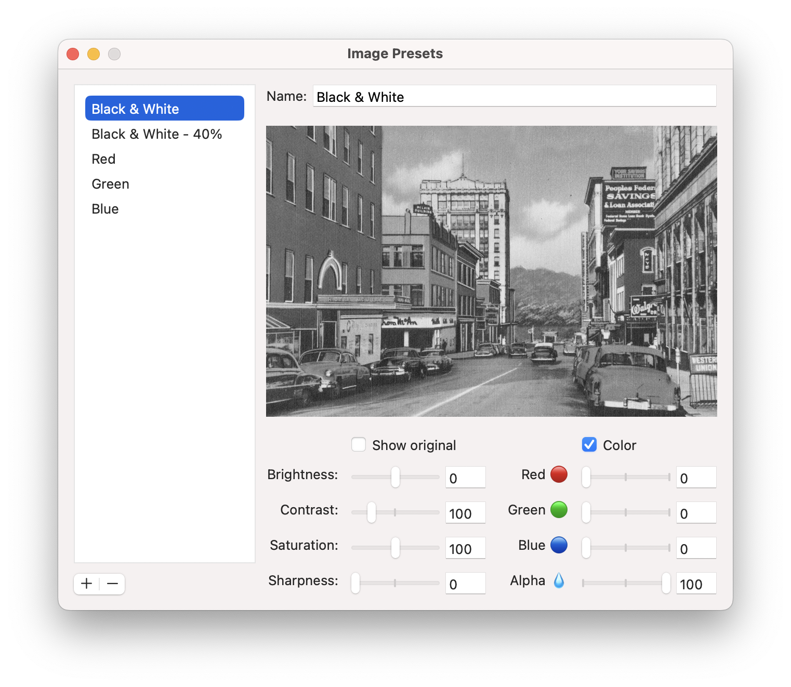
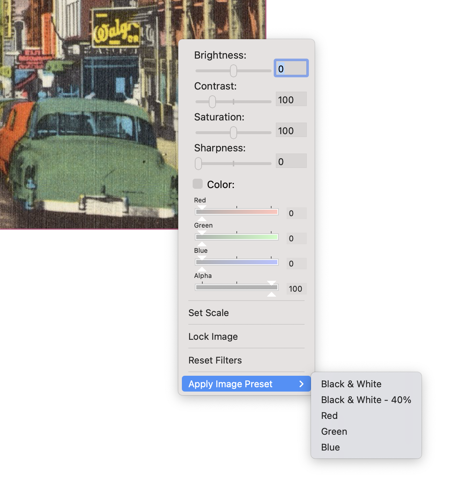
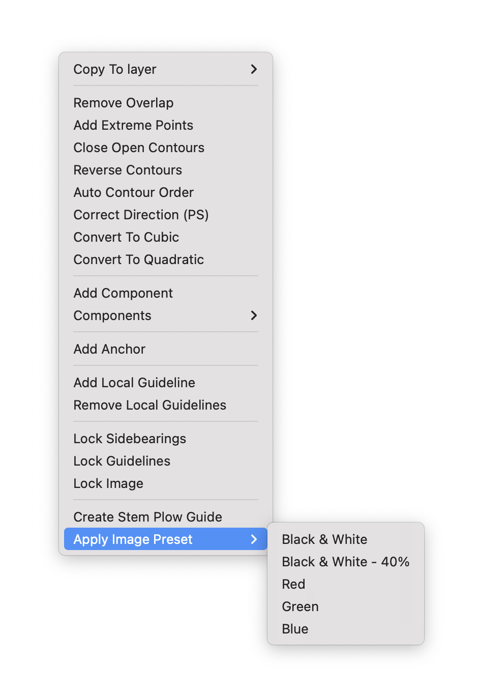

Image Presets
==========

A RoboFont extension that provides an interface for creating image presets, and menus in the glyph editor to apply them.

_Placeholder image credit: Boston Public Library via Unsplash_

Installation
------------

Download and double-click the `.roboFontExt` file <!-- to install manually, or get it via [Mechanic2](http://robofontmechanic.com/).-->

When installed, the ImagePresets window becomes available from the _Extensions_ menu.

Usage
-----

- Open the Image Presets window
- Create a preset using the add button below the list
- Open the glyph editor
- Place an image
- Apply the preset > by right-clicking on the image if it is not locked, or right-clicking anywhere in the glyph view > select _Apply Image Preset_ then select your preset's name in the submenu

    
    

Available settings
------------------

Those available on image right-click in the glyph view:
- Brightness
- Saturation
- Contrast
- Sharpness
- Color: red, green, blue, alpha
