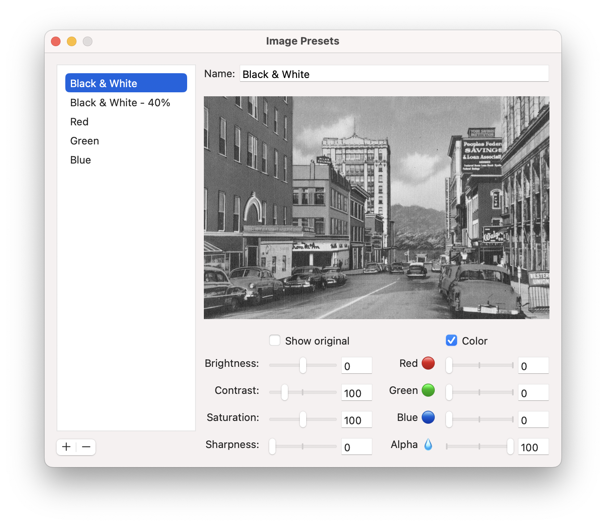
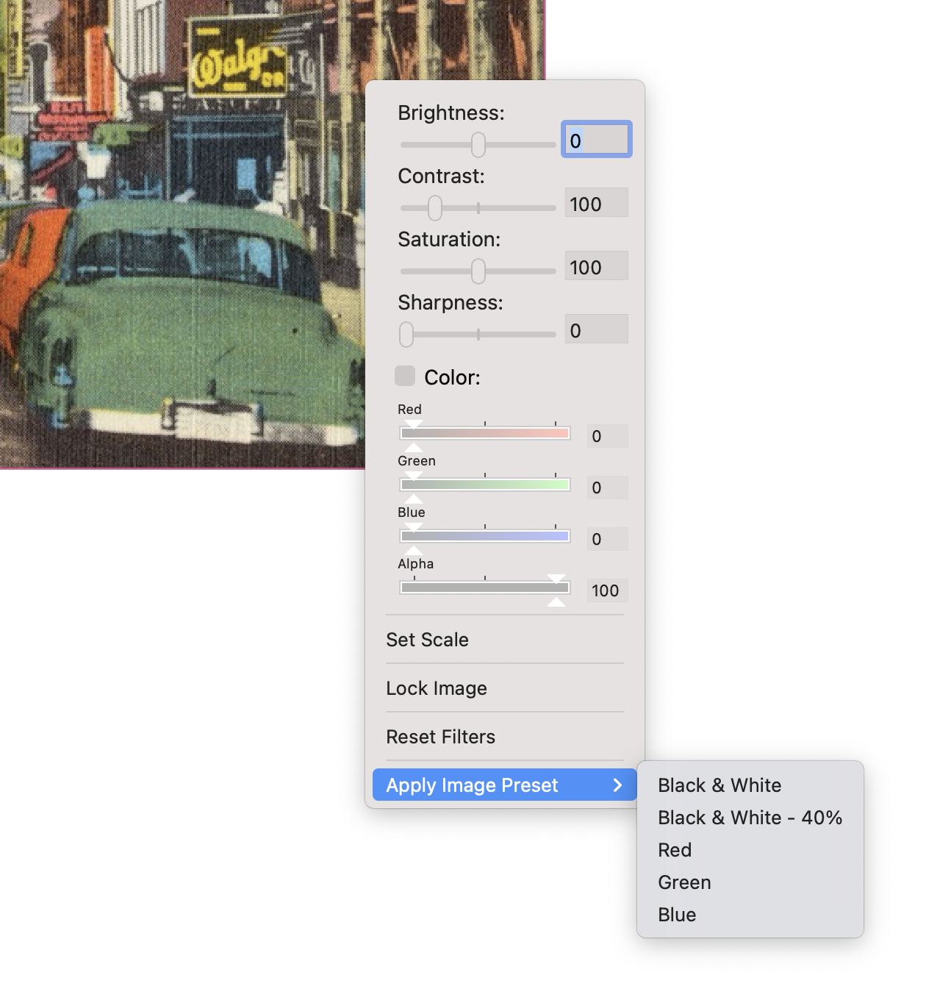
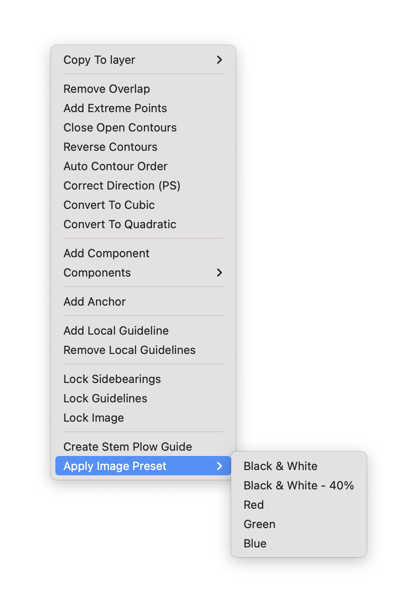

# Image Presets

A RoboFont extension that provides an interface for creating image presets, and menus in the glyph editor to apply them.

_Placeholder image credit: Boston Public Library via Unsplash_

## Installation

Download and double-click the `.roboFontExt` file in the Releases section to install manually, or get it via [Mechanic2](http://robofontmechanic.com/).

When installed, the ImagePresets window becomes available from the _Extensions_ menu.

## Usage

- Open the Image Presets window
- Create a preset using the add button below the list
- Open the glyph editor
- Place an image
- Apply the preset > by right-clicking on the image if it is not locked, or right-clicking anywhere in the glyph view > select _Apply Image Preset_ then select your preset's name in the submenu

    
    

## Available settings

Those available on image right-click in the glyph view:

- Brightness
- Saturation
- Contrast
- Sharpness
- Color: red, green, blue, alpha

## Scripting

### API - `imagePresetsLib`

The extension API is accessible in the RoboFont environment through the `imagePresetsLib` module once the extension finished loading.

_WIP: write the detailed documentation_

### Subscriber events

**ImagePresets** posts the following Subscriber events when changes happen through the extension **UI or API**:

#### `imagePresetsManagerWillAddPreset`

When a preset is going to be registered.

The `info` dictionary contains:

- `preset`: The `Preset` object that is going to be registered.

#### `imagePresetsManagerDidAddPreset`

When a preset was just registered.

The `info` dictionary contains:

- `preset`: The `Preset` object that was registered.

#### `imagePresetsManagerWillRemovePreset`

When a preset is going to be removed.

The `info` dictionary contains:

- `preset`: The `Preset` object that is going to be removed.

#### `imagePresetsManagerDidRemovePreset`

When a preset was just removed.

The `info` dictionary contains:

- `preset`: The `Preset` object that was removed.

#### `imagePresetsManagerPresetChanged`

When a preset changed.

The `info` dictionary contains:

- `old`: The dictionary representing the previous data of the `Preset`.
- `new`: The dictionary representing the current data of the `Preset`.
- `preset`: The `Preset` object that changed.
