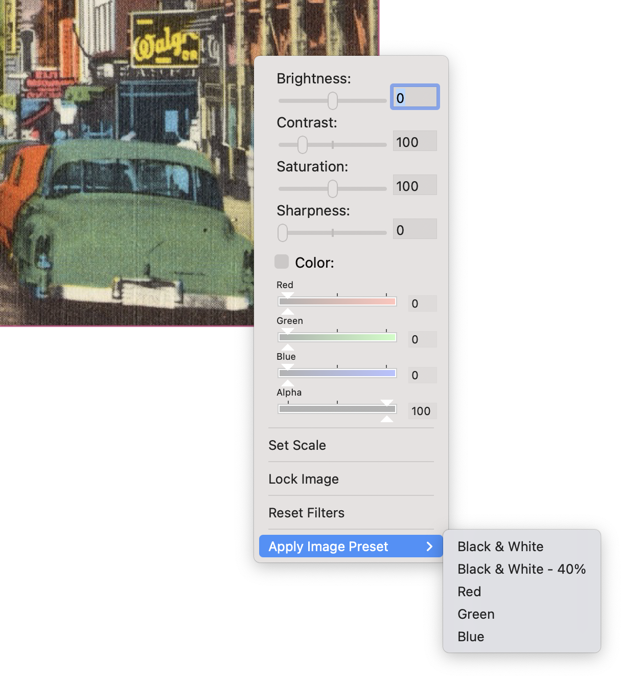
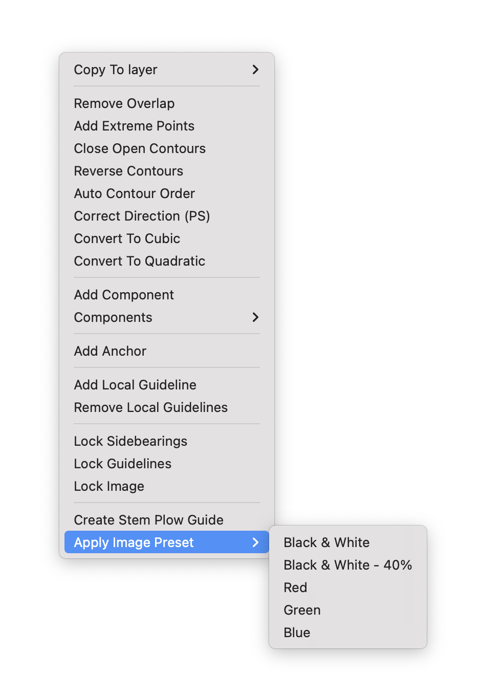

Image Presets
==========

Usage
-----

- Open the Image Presets window
- Create a preset using the add button below the list
- Open the glyph editor
- Place an image
- Apply the preset > by right-clicking on the image if it is not locked, or right-clicking anywhere in the glyph view > select _Apply Image Preset_ then select your preset's name in the submenu

    
    

Available settings
------------------

Those available on image right-click in the glyph view:
* Brightness
* Saturation
* Contrast
* Sharpness
* Color: red, green, blue, alpha
